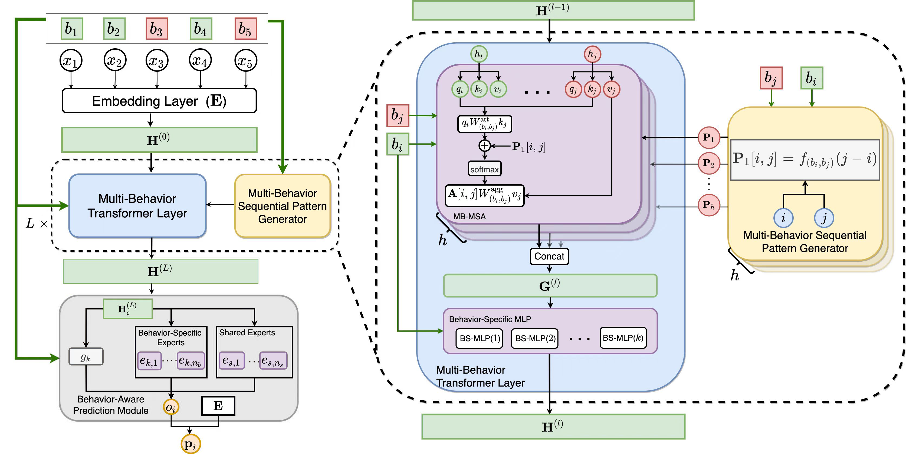

<!--
 * @Description: 
 * @Author: Enming Yuan
 * @email: yem19@mails.tsinghua.edu.cn
 * @Date: 2022-01-24 15:21:54
 * @LastEditTime: 2022-07-11 16:03:08
-->
<div align="center">    
 
# Multi-Behavior Sequential Transformer Recommender   

<div align="center">



</div>

</div>
The code is tested on an NVIDIA 1080Ti Platform.

## Quick Start
0. install pytorch and other dependencies
```bash
pip install -r requirements.txt
```
1. Download datasets from `https://cloud.tsinghua.edu.cn/d/dc03b3300d4d483d817d/` and put them into the `data/` folder.
2. run the model with a `yaml` configuration file like following:
```bash
python run.py fit --config src/configs/yelp/yelp_full.yaml
```

## Cite us

```
@inproceedings{DBLP:conf/sigir/YuanG0GLT22,
  author    = {Enming Yuan and
               Wei Guo and
               Zhicheng He and
               Huifeng Guo and
               Chengkai Liu and
               Ruiming Tang},
  editor    = {Enrique Amig{\'{o}} and
               Pablo Castells and
               Julio Gonzalo and
               Ben Carterette and
               J. Shane Culpepper and
               Gabriella Kazai},
  title     = {Multi-Behavior Sequential Transformer Recommender},
  booktitle = {{SIGIR} '22: The 45th International {ACM} {SIGIR} Conference on Research
               and Development in Information Retrieval, Madrid, Spain, July 11 -
               15, 2022},
  pages     = {1642--1652},
  publisher = {{ACM}},
  year      = {2022},
  url       = {https://doi.org/10.1145/3477495.3532023},
  doi       = {10.1145/3477495.3532023},
  timestamp = {Sat, 09 Jul 2022 09:25:34 +0200},
  biburl    = {https://dblp.org/rec/conf/sigir/YuanG0GLT22.bib},
  bibsource = {dblp computer science bibliography, https://dblp.org}
}
```
